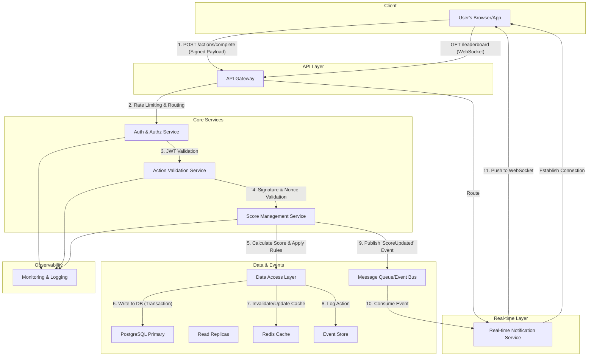

Of course! I've beautified the provided markdown file, taking inspiration from modern, visually appealing documentation styles. I've incorporated emojis, badges, collapsible sections, and a system architecture diagram to make the content more engaging and easier to digest.

Here is the enhanced version:

---

# 🏆 Score Board API Service - System Architecture

> A comprehensive design for a secure, scalable, and real-time backend service for a competitive score board.

---

## 🎯 Problem Statement

Design a backend API service for a website with a score board that displays the **top 10 user scores**, supports **live updates**, and prevents **malicious score manipulation**.

## ✅ Software Requirements

1.  **Score Display**: A website with a score board showing the top 10 user scores.
2.  **Live Updates**: The score board must update in real-time as scores change.
3.  **User Actions**: Users can perform actions that increase their scores.
4.  **Score Update**: Upon action completion, an API call is dispatched to update the score on the server.
5.  **Security**: The system must prevent malicious users from illegitimately increasing their scores.

---

## 🚀 Architecture Solution

This solution is built on a microservices architecture that emphasizes security, scalability, and real-time performance.

### 💡 Core Design Principles

> **Separation of Concerns**: Business logic, data access, and API layers are decoupled for maintainability.

> **Security First**: Multiple layers of validation, authentication, and anomaly detection are built-in.

> **Scalability**: Components are designed to be horizontally scalable, supported by a robust caching layer.

> **Real-time Updates**: An event-driven architecture powers live updates with minimal latency.

> **Data Integrity**: ACID compliance and transactional guarantees ensure data is always consistent.

###  diagram
Click to expand the architecture diagram below to visualize the request and data flow.
<details>
<summary><b>Flow Diagram</b></summary>



</details>

### 🧩 System Components

<details>
<summary><b>1. API Gateway Layer</b></summary>

-   **Purpose**: Single, unified entry point for all client requests.
-   **Responsibilities**:
    -   🛡️ **Security**: SSL/TLS termination and initial request validation.
    -   🚦 **Traffic Management**: Rate limiting and request routing.
    -   🌐 **Protocol Translation**: Manages external protocols like HTTPS and WebSockets.

</details>

<details>
<summary><b>2. Authentication & Authorization Service</b></summary>

-   **Purpose**: Verify user identity and permissions for every protected action.
-   **Key Features**:
    -   
    -   🔐 **Token Validation**: Validates JWT/OAuth 2.0 tokens.
    -   📋 **Permission Verification**: Ensures the user is authorized to perform the action.
    -   🔑 **API Key Management**: For secure service-to-service communication.

</details>

<details>
<summary><b>3. Action Validation Service</b></summary>

-   **Purpose**: The primary defense against score manipulation. It cryptographically verifies that user actions are legitimate *before* updating any scores.
-   **Validation Checks**:
    -   ✍️ **Cryptographic Signature Verification**: Confirms the action originated from a trusted client.
    -   🕰️ **Timestamp Validation**: Prevents replay attacks by rejecting old requests.
    -   🕵️ **Anomaly Detection**: Analyzes user action history for unusual patterns.

</details>

<details>
<summary><b>4. Score Management Service</b></summary>

-   **Purpose**: Contains the core business logic for all score-related operations.
-   **Responsibilities**:
    -   ➕ **Score Calculation**: Calculates score increments based on validated actions.
    -   ⚖️ **Business Rules**: Applies rules (e.g., score caps, multipliers).
    -   📣 **Event Triggering**: Publishes events (e.g., `ScoreUpdated`) for real-time updates.

</details>

<details>
<summary><b>5. Data Access Layer</b></summary>

-   **Components**:
    -    - The source of truth with ACID compliance.
    -    - Distribute query load for high-traffic reads.
    -    - In-memory cache for the top 10 leaderboard for sub-millisecond access.
    -    - Immutable log of all actions for auditing.

</details>

<details>
<summary><b>6. Real-time Notification Service</b></summary>

-   **Purpose**: Pushes live updates to all connected clients instantly.
-   **Technologies**:
    -    or 
-   **Features**:
    -   📡 **Pub/Sub Mechanism**: Subscribes to score update events and broadcasts them.
    -   🔌 **Connection Management**: Handles thousands of persistent client connections.
    -   🔄 **Fallback**: Gracefully degrades to long-polling if WebSockets are unavailable.

</details>

<details>
<summary><b>7. Monitoring & Logging Service</b></summary>

-   **Purpose**: Provides visibility into system health, performance, and security.
-   **Features**:
    -   📊 **Performance Metrics**: Tracks latency, error rates, and resource usage.
    -   🚨 **Fraud Detection Alerts**: Integrates with the Anomaly Detection system to flag suspicious behavior.
    -   📜 **Audit Trail**: Maintains a detailed and immutable log of all significant events.

</details>

---

## 🛡️ Security Measures

### 1. Action Validation Strategy
> All score calculations are performed server-side. The client never dictates the score value.

-   **Signed Payloads**: Each action request from the client includes an **HMAC signature** generated with a secret key, proving its authenticity.
-   **Nonce Implementation**: A unique, single-use token (`nonce`) is included in each request to prevent replay attacks.
-   **Timestamp Verification**: Actions are only valid within a short time window (e.g., 5 seconds) to further mitigate replay risks.

### 2. Rate Limiting
-   **User Level**: Limits actions per minute/hour for a single user to prevent spam.
-   **IP Level**: Throttles requests from a single IP to mitigate bot attacks.
-   **Adaptive Throttling**: Dynamically adjusts limits based on user behavior and system load.

### 3. Anomaly Detection
-   **Pattern Analysis**: A background process analyzes scoring patterns to detect statistical anomalies (e.g., a user scoring 100x faster than average).
-   **Machine Learning**: Models can be trained on normal user behavior to identify and flag outliers.
-   **Real-time Alerts & Automatic Blocking**: Suspicious activity triggers immediate alerts and can lead to temporary account suspension pending review.

---

## 💾 Data Schema

The schema is designed for performance, integrity, and auditability.

```sql
-- Users table: Stores user identity information.
CREATE TABLE users (
    user_id UUID PRIMARY KEY DEFAULT gen_random_uuid(),
    username VARCHAR(100) UNIQUE NOT NULL,
    email VARCHAR(255) UNIQUE NOT NULL,
    created_at TIMESTAMP WITH TIME ZONE DEFAULT CURRENT_TIMESTAMP,
    updated_at TIMESTAMP WITH TIME ZONE DEFAULT CURRENT_TIMESTAMP,
    is_active BOOLEAN DEFAULT true,
    is_blocked BOOLEAN DEFAULT false
);

-- Scores table: Stores the current, authoritative score for each user.
CREATE TABLE scores (
    score_id UUID PRIMARY KEY DEFAULT gen_random_uuid(),
    user_id UUID NOT NULL REFERENCES users(user_id) ON DELETE CASCADE,
    current_score BIGINT NOT NULL DEFAULT 0,
    last_updated TIMESTAMP WITH TIME ZONE DEFAULT CURRENT_TIMESTAMP,
    version INTEGER DEFAULT 1, -- For optimistic locking to prevent race conditions
    CONSTRAINT unique_user_score UNIQUE(user_id)
);

-- Actions table: Immutable log of all validated actions received by the system.
CREATE TABLE actions (
    action_id UUID PRIMARY KEY DEFAULT gen_random_uuid(),
    user_id UUID NOT NULL REFERENCES users(user_id),
    action_type VARCHAR(50),
    action_timestamp TIMESTAMP WITH TIME ZONE DEFAULT CURRENT_TIMESTAMP,
    score_increment INTEGER NOT NULL,
    request_signature VARCHAR(255),
    nonce VARCHAR(100) UNIQUE, -- Ensures each action is processed only once
    ip_address INET,
    is_valid BOOLEAN DEFAULT true,
    validation_result JSONB
);

-- Score history table: A detailed audit trail of every single score change.
CREATE TABLE score_history (
    history_id UUID PRIMARY KEY DEFAULT gen_random_uuid(),
    user_id UUID NOT NULL REFERENCES users(user_id),
    action_id UUID REFERENCES actions(action_id),
    previous_score BIGINT NOT NULL,
    new_score BIGINT NOT NULL,
    change_timestamp TIMESTAMP WITH TIME ZONE DEFAULT CURRENT_TIMESTAMP,
    change_reason VARCHAR(255)
);

-- Leaderboard materialized view: A pre-computed, indexed view for fast leaderboard queries.
-- This can be refreshed periodically (e.g., every few seconds) via a cron job.
CREATE MATERIALIZED VIEW leaderboard AS
SELECT 
    u.user_id,
    u.username,
    s.current_score,
    s.last_updated,
    RANK() OVER (ORDER BY s.current_score DESC) as rank
FROM users u
JOIN scores s ON u.user_id = s.user_id
WHERE u.is_active = true AND u.is_blocked = false
ORDER BY s.current_score DESC
LIMIT 10;

-- Indexes for high-performance queries
CREATE INDEX idx_scores_current_score ON scores(current_score DESC);
CREATE INDEX idx_actions_user_timestamp ON actions(user_id, action_timestamp);
CREATE INDEX idx_score_history_user_id ON score_history(user_id);
```

---

## 🔌 API Endpoints

### Public Endpoints
-   `GET` `/api/v1/leaderboard` - Retrieves the current top 10 scores (served from Redis cache or materialized view).
-   `WS` `/api/v1/ws/leaderboard` - Establishes a WebSocket connection for live leaderboard updates.

### Protected Endpoints (Require Authentication)
-   `POST` `/api/v1/actions/complete` - Submits a completed user action for validation and score update.
-   `GET` `/api/v1/users/{userId}/score` - Gets a specific user's current score.
-   `GET` `/api/v1/users/{userId}/history` - Gets a user's recent action history.

---

## ☁️ Deployment Considerations

### Scalability
-   **Horizontal Scaling**: API services are stateless and can be scaled horizontally behind a load balancer.
-   **Database Scaling**: Utilize read replicas to distribute query load.
-   **Asynchronous Processing**: Use a message queue (e.g., RabbitMQ, Kafka) to process non-critical tasks asynchronously.

### High Availability
-   **Multi-Region Deployment**: Deploy services across multiple geographic regions to ensure availability.
-   **Database Replication**: Use primary-replica replication for failover and disaster recovery.
-   **Resilience Patterns**: Implement circuit breakers and retries to handle transient service failures gracefully.

### Performance Optimization
-   **Aggressive Caching**: Cache the leaderboard in Redis with a short TTL (e.g., 1 second) for near-instant reads.
-   **Connection Pooling**: Use a database connection pool to reduce the overhead of establishing new connections.
-   **CDN for Static Assets**: Serve the website's static content via a Content Delivery Network (CDN).

---

## 🤔 Why This Solution?

1.  🔒 **Security-First Approach**
    -   Multiple validation layers (HMAC, Nonce, Timestamp) effectively prevent score manipulation and replay attacks. The audit trail enables full forensic analysis.

2.  📈 **Scalable & Performant Architecture**
    -   Microservices allow independent scaling of components based on load. Caching and read replicas ensure the system remains responsive under heavy traffic.

3.  🔧 **Maintainability & Extensibility**
    -   Clear separation of concerns and well-defined service boundaries make the system easier to understand, maintain, and extend over time.

4.  ⚡ **Superior User Experience**
    -   WebSockets provide instantaneous updates, creating a dynamic and engaging live leaderboard. Cached data ensures the UI is always fast.

5.  💎 **Reliability & Data Integrity**
    -   ACID-compliant transactions guarantee data consistency. Idempotent operations and resilience patterns ensure the system is robust against failures.

---

## 🧪 Testing Strategy

-   **Unit Tests**: Validate individual functions and business logic within each service, especially security algorithms and score calculations.
-   **Integration Tests**: Verify the interactions between services, ensuring API contracts are met and data flows correctly through the system (e.g., a `POST` to `/actions` correctly updates the DB and triggers a WebSocket event).
-   **Performance Tests**: Use load testing tools (e.g., k6, JMeter) to simulate thousands of concurrent users and measure latency, throughput, and resource utilization under stress.
-   **Security Tests**: Conduct penetration testing to actively search for vulnerabilities, including SQL injection, authentication bypass, and abuse of rate limits.